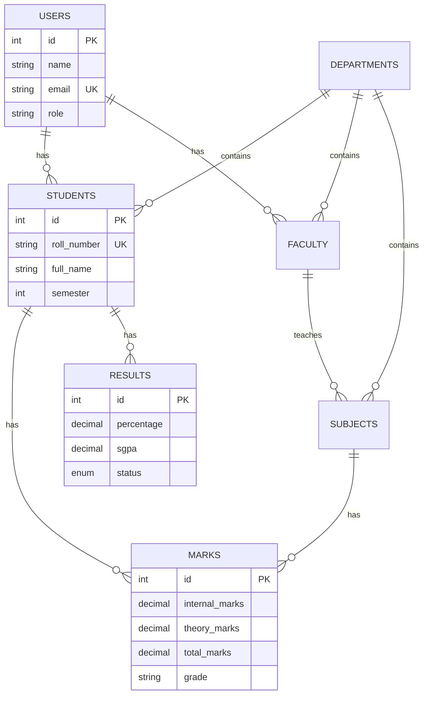

# Student Result Management System

> Full-stack web application for managing students, faculty, departments, marks, semester results, and rank lists with role-based access control.


---

## Business Problem

Colleges and universities need a centralized system to manage academic records — from student enrollment and faculty management to marks entry, result generation, and rank list publishing. Manual or spreadsheet-based tracking is error-prone, lacks audit trails, and doesn't scale.

## Solution

SRMS provides a complete web-based platform with role-based dashboards, automated SGPA/CGPA calculation, and printable marksheets.

---

## Features

| Module | Capabilities |
|--------|-------------|
| **Authentication** | JWT login, bcrypt hashing, role-based access |
| **Students** | Full CRUD, search, filter, pagination |
| **Faculty** | Create, update, assign to departments |
| **Subjects** | Credit management, semester mapping, faculty assignment |
| **Marks Entry** | Single & bulk entry, live grade preview, locking |
| **Results** | Automated SGPA/CGPA calculation, pass/fail status |
| **Rank List** | Merit-based ranking per semester |
| **Marksheet** | Detailed printable marksheet with grade report |
| **Dashboard** | Admin statistics, student result overview |

---

## Tech Stack

| Layer | Technology |
|-------|-----------|
| Frontend | React 18, React Router, Tailwind CSS |
| Backend | Node.js 18+, Express.js 4 |
| Database | MySQL 8.0, Sequelize ORM |
| Authentication | JWT, bcryptjs |
| Security | Helmet.js, CORS, Rate Limiting |
| Testing | Jest, Supertest |

---

## Architecture

```
┌─────────────────────────────────────────────────────────┐
│                    React Frontend                        │
│            (Tailwind CSS, React Router)                  │
└────────────────────────┬────────────────────────────────┘
                         │ HTTP/JSON
┌────────────────────────▼────────────────────────────────┐
│              Express.js REST API                        │
│           (JWT Auth, RBAC Middleware)                    │
├─────────────────────────────────────────────────────────┤
│           Sequelize ORM (Models, Associations)          │
├─────────────────────────────────────────────────────────┤
│              MySQL 8.0 Database                         │
└─────────────────────────────────────────────────────────┘
```

---

## ER Diagram



---

## API Endpoints

| Method | Endpoint | Description | Auth |
|--------|----------|-------------|------|
| POST | `/api/v1/auth/login` | Login & get JWT | Public |
| GET | `/api/v1/auth/me` | Get current user | Yes |
| PUT | `/api/v1/auth/change-password` | Change password | Yes |
| **Students** | | | |
| GET | `/api/v1/students` | List (paginated) | Yes |
| GET | `/api/v1/students/:id` | Get by ID | Yes |
| POST | `/api/v1/students` | Create student | Admin |
| PUT | `/api/v1/students/:id` | Update student | Admin |
| DELETE | `/api/v1/students/:id` | Delete student | Admin |
| **Faculty** | | | |
| GET | `/api/v1/faculty` | List faculty | Yes |
| POST | `/api/v1/faculty` | Create faculty | Admin |
| PUT | `/api/v1/faculty/:id` | Update faculty | Admin |
| DELETE | `/api/v1/faculty/:id` | Delete faculty | Admin |
| **Marks** | | | |
| GET | `/api/v1/marks` | List marks | Yes |
| POST | `/api/v1/marks` | Enter marks | Faculty |
| POST | `/api/v1/marks/bulk` | Bulk enter | Faculty |
| POST | `/api/v1/marks/lock` | Lock marks | Admin |
| **Results** | | | |
| GET | `/api/v1/results` | List results | Yes |
| POST | `/api/v1/results/generate` | Generate result | Admin |
| POST | `/api/v1/results/publish` | Publish result | Admin |
| GET | `/api/v1/results/rank-list/:sem` | Rank list | Yes |
| GET | `/api/v1/results/marksheet/:id/:sem` | Marksheet | Yes |

---

## Installation Guide

### Prerequisites

- **Node.js 18+** — [Download](https://nodejs.org/)
- **MySQL 8.0+** — [Download](https://dev.mysql.com/)

### Setup

```bash
# Clone the repository
git clone https://github.com/ansht120/college-full-stack-web-development-project.git
cd college-full-stack-web-development-project

# --- Backend Setup ---
cd backend
npm install
cp .env.example .env
# Edit .env with your MySQL credentials
npm run dev

# --- Frontend Setup (new terminal) ---
cd frontend
npm install
npm start

# --- Database Setup (new terminal) ---
mysql -u root -p < database/schema.sql
mysql -u root -p < database/seed.sql
```

### Run Tests

```bash
cd backend
npm test
```

---

## Environment Variables

| Variable | Description | Default |
|----------|-------------|---------|
| `PORT` | Server port | `5000` |
| `DB_HOST` | MySQL host | `localhost` |
| `DB_PORT` | MySQL port | `3306` |
| `DB_USER` | MySQL user | `root` |
| `DB_PASSWORD` | MySQL password | — |
| `DB_NAME` | Database name | `student_result_db` |
| `JWT_SECRET` | JWT secret key | — |
| `JWT_EXPIRES_IN` | Token expiry | `7d` |
| `CORS_ORIGIN` | Frontend URL | `http://localhost:3000` |

---

## Default Credentials

| Role | Email | Password |
|------|-------|----------|
| Admin | `admin@college.com` | `Password@123` |
| Faculty | `rajesh@college.com` | `Password@123` |
| Student | `rahul@student.com` | `Password@123` |

---

## Project Structure

```
├── backend/
│   ├── config/          # Database configuration
│   ├── controllers/     # Route handlers (7 controllers)
│   ├── middleware/       # JWT auth middleware
│   ├── models/          # Sequelize models (7 entities)
│   ├── routes/          # API routes (7 route files)
│   ├── tests/           # Jest unit tests
│   ├── utils/           # Grade calculator
│   └── server.js        # Entry point
├── frontend/
│   ├── src/
│   │   ├── components/  # Modal, StatCard, Layout, Sidebar
│   │   ├── context/     # Auth context provider
│   │   ├── pages/       # 9 page components
│   │   └── utils/       # Axios API utility
│   └── package.json
├── database/
│   ├── schema.sql       # 7 normalized tables
│   └── seed.sql         # Sample data
└── .github/workflows/   # CI pipeline
```

---

## Resume Highlights

> **Student Result Management System** — Full-stack web application for academic record management
> - Built RESTful API with Express.js handling 15+ endpoints with JWT authentication and role-based authorization
> - Designed MySQL schema with 7 normalized tables, foreign key constraints, and optimized indexes
> - Implemented marks entry system with automated SGPA/CGPA calculation and grade assignment
> - Created React frontend with 9 pages including dashboard, CRUD operations, and printable marksheet
> - Applied security best practices: bcrypt hashing, Helmet.js, CORS, rate limiting

---

## License

MIT License - see [LICENSE](LICENSE) for details.
