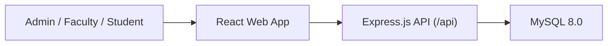
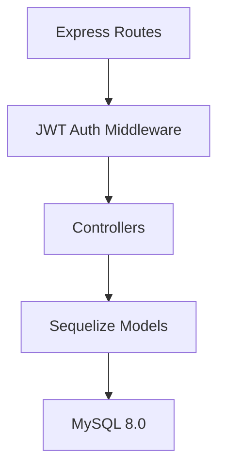
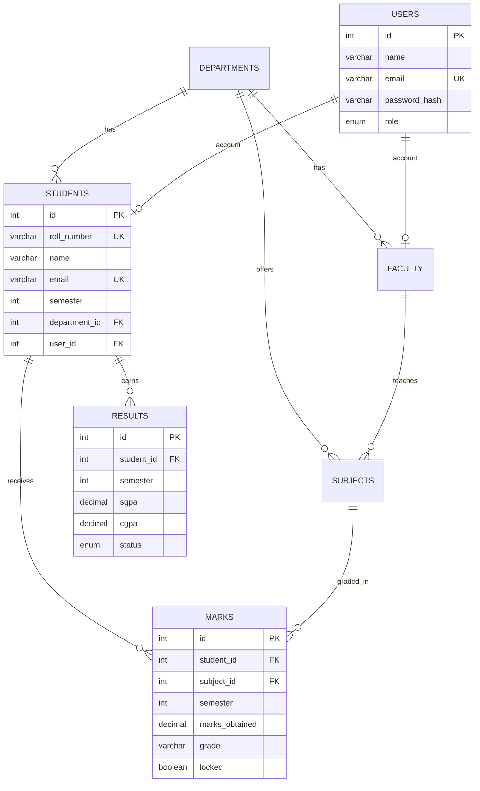
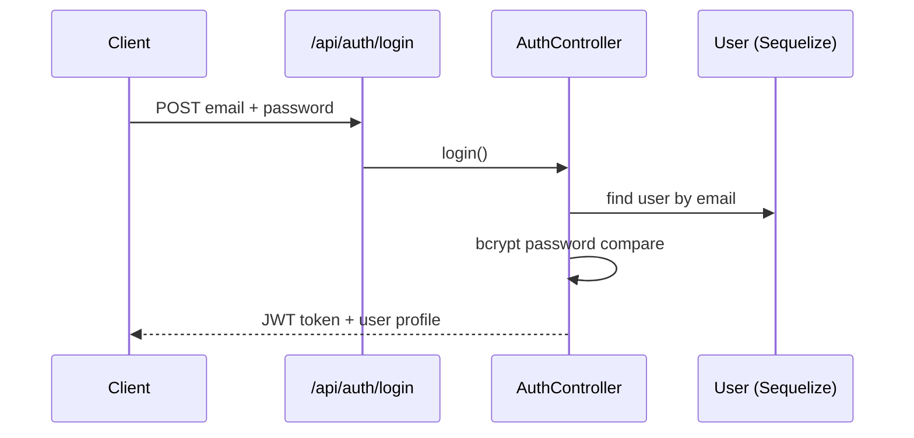

# Architecture

## System Context

```mermaid
flowchart LR
    User["Admin / Faculty / Student"] --> React["React Web App"]
    React --> Api["Express.js API (/api)"]
    Api --> Db["MySQL 8.0"]
```

## Backend Layers

```mermaid
flowchart TD
    Routes["Express Routes"] --> Middleware["JWT Auth Middleware"]
    Middleware --> Controller["Controllers"]
    Controller --> Model["Sequelize Models"]
    Model --> Database["MySQL 8.0"]
```

## ER Diagram

```mermaid
erDiagram
    DEPARTMENTS ||--o{ STUDENTS : has
    DEPARTMENTS ||--o{ FACULTY : has
    DEPARTMENTS ||--o{ SUBJECTS : offers
    FACULTY ||--o{ SUBJECTS : teaches
    STUDENTS ||--o{ MARKS : receives
    SUBJECTS ||--o{ MARKS : graded_in
    STUDENTS ||--o{ RESULTS : earns
    USERS ||--o| STUDENTS : account
    USERS ||--o| FACULTY : account
    USERS {
        int id PK
        varchar name
        varchar email UK
        varchar password_hash
        enum role
    }
    STUDENTS {
        int id PK
        varchar roll_number UK
        varchar name
        varchar email UK
        int semester
        int department_id FK
        int user_id FK
    }
    MARKS {
        int id PK
        int student_id FK
        int subject_id FK
        int semester
        decimal marks_obtained
        varchar grade
        boolean locked
    }
    RESULTS {
        int id PK
        int student_id FK
        int semester
        decimal sgpa
        decimal cgpa
        enum status
    }
```

## Login Sequence

```mermaid
sequenceDiagram
    participant Client
    participant AuthRoute as /api/auth/login
    participant AuthController
    participant UserModel as User (Sequelize)
    Client->>AuthRoute: POST email + password
    AuthRoute->>AuthController: login()
    AuthController->>UserModel: find user by email
    AuthController->>AuthController: bcrypt password compare
    AuthController-->>Client: JWT token + user profile
```
